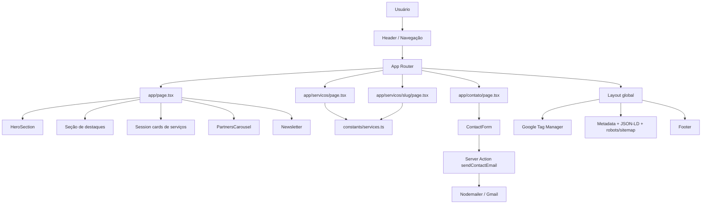

# Meta Consultoria

Site institucional da Meta Consultoria, construído com Next.js App Router, TypeScript e Tailwind CSS v4. O projeto foi organizado para suportar páginas institucionais, páginas de serviços, SEO centralizado e captação de leads via formulário de contato.

## Visão Geral

O site é estruturado em torno de três blocos principais:

1. apresentação institucional, com home, quem somos e páginas de confiança;
2. catálogo de serviços, com páginas por área e por serviço específico;
3. conversão, com formulário de contato, CTA em várias seções e newsletter.

O layout global injeta cabeçalho, rodapé, metadata, JSON-LD, Google Tag Manager e estados de carregamento/erro em toda a aplicação.

## Tecnologias Usadas

- Next.js 16 com App Router e Server Actions
- React 19
- TypeScript
- Tailwind CSS v4
- shadcn/ui e Radix UI
- Lucide React e React Icons
- Embla Carousel
- Nodemailer para envio de e-mails
- `@next/third-parties` para Google Tag Manager
- `react-simple-icons` e utilitários de classe como `clsx` e `tailwind-merge`

## Como Rodar

```bash
npm install
npm run dev
```

A aplicação sobe em `http://localhost:3000`.

### Scripts disponíveis

- `npm run dev`: ambiente de desenvolvimento
- `npm run build`: build de produção
- `npm run start`: executa o build gerado
- `npm run lint`: validação com ESLint

## Arquitetura E Fluxo

O projeto segue uma estrutura de composição por páginas e seções reutilizáveis. A home e as páginas internas montam blocos prontos, enquanto os dados dos serviços ficam centralizados em `constants/services.ts`.



### Lógica principal

- A home monta a experiência de entrada com `HeroSection`, blocos de destaque, cards de serviços, carrossel de parceiros, uma seção de novo serviço, depoimentos e newsletter.
- A listagem de serviços usa `coordinations` como fonte única de verdade para áreas e itens.
- A página dinâmica `/servicos/[slug]` procura o serviço correspondente nos dados centralizados, gera metadata por rota e pré-renderiza as páginas com `generateStaticParams`.
- O formulário de contato envia os dados via Server Action para `sendContactEmail`, que usa Nodemailer com Gmail e variáveis de ambiente.
- O `layout.tsx` concentra cabeçalho, rodapé, metadata global, JSON-LD organizacional e o carregamento opcional do GTM.

## Rotas

### Páginas principais

- `/` - home
- `/servicos` - visão geral das áreas de atuação
- `/servicos/[slug]` - página dinâmica de serviço
- `/contato` - contato e captação de leads
- `/obrigado` - página de confirmação pós-envio
- `/quem-somos` - página institucional
- `/quem-somos/sobre-nos` - sobre a empresa
- `/quem-somos/SETTA` - página institucional SETTA
- `/quem-somos/politica-de-privacidade` - política de privacidade

### Áreas de serviço

- `/servicos/gnc`
- `/servicos/ot_pr`
- `/servicos/plan_fin`
- `/servicos/constr_energ`
- `/servicos/des_maq`
- `/servicos/tecnologia`

### Serviços individuais cadastrados em `constants/services.ts`

- Gestão de Negócios: `/servicos/gnc/analise-de-mercado`, `/servicos/gnc/posicionamento-de-marca`, `/servicos/gnc/planejamento-estrategico`
- Otimização de Processos: `/servicos/ot_pr/mapeamento-de-processos`, `/servicos/ot_pr/pesquisa-de-clima`, `/servicos/ot_pr/estruturacao-interna`, `/servicos/ot_pr/gestao-de-estoque`, `/servicos/ot_pr/estudo-de-tempo`, `/servicos/ot_pr/simulacao-de-processos`
- Planejamento Financeiro: `/servicos/plan_fin/fp-a`, `/servicos/plan_fin/estudo-de-viabilidade`, `/servicos/plan_fin/precificacao-de-produtos`
- Construção e Energia: `/servicos/constr_energ/projeto-arquitetonico`, `/servicos/constr_energ/instalacoes-hidrossanitarias`, `/servicos/constr_energ/regularizacao-de-imoveis`, `/servicos/constr_energ/orcamento-de-obras`, `/servicos/constr_energ/vistoria-hidrossanitaria-predial`, `/servicos/constr_energ/estudo-de-luminotecnica`, `/servicos/constr_energ/instalacoes-eletricas`
- Desenvolvimento de Máquinas: `/servicos/des_maq/desenho-mecanico`, `/servicos/des_maq/estudo-de-materiais`, `/servicos/des_maq/prototipagem-3d`, `/servicos/des_maq/analise-estrutural`, `/servicos/des_maq/manuais-tecnicos`
- Tecnologia: `/servicos/tecnologia/desenvolvimento-de-site`, `/servicos/tecnologia/desenvolvimento-de-aplicativos`, `/servicos/tecnologia/automacao-de-processos`, `/servicos/tecnologia/direcionamento_estrategico`

## Fluxo De Componentes

### Estrutura global

- `app/layout.tsx` injeta `Header`, `main` e `Footer`.
- O layout também adiciona metadata global, sitemap, robots e o schema `Organization` em JSON-LD.
- O componente `Header` usa navegação fixa com dropdown para “Quem somos” e “Serviços” e versão mobile via `MobileMenu`.
- O `Footer` fecha a navegação com links institucionais, redes sociais, endereço e CTA de conteúdo.

### Home

- `app/page.tsx` monta a home em blocos sequenciais.
- `HeroSection` abre a página com imagem de fundo, título e CTA.
- `Session` é usado para os cards de áreas de serviço com link para cada rota.
- `PartnersCarousel` exibe logos de parceiros/clients.
- `Newsletter` encerra a jornada com captura de e-mail.

### Página de serviço

- `app/servicos/[slug]/page.tsx` resolve o slug no catálogo.
- Se o serviço não existir, a página chama `notFound()`.
- Cada página de serviço exibe hero, imagem, introdução, metodologia, formulário de contato e diferenciais.
- As páginas são pré-renderizadas com base no catálogo em tempo de build.

## Formulário De Contato

O envio de mensagens acontece sem API externa dedicada.

- o formulário coleta nome, e-mail, telefone, investimento e mensagem;
- o submit chama a Server Action `sendContactEmail`;
- a action valida campos obrigatórios;
- o e-mail é disparado com Nodemailer usando `EMAIL_USER` e `EMAIL_PASS`.

### Variáveis de ambiente

Defina no `.env.local`:

```bash
EMAIL_USER=seu-email@gmail.com
EMAIL_PASS=sua-senha-de-aplicativo
NEXT_PUBLIC_GTM_ID=GTM-XXXXXXX
```

## Estrutura Do Projeto

```text
app/
  layout.tsx
  page.tsx
  contato/
  obrigado/
  quem-somos/
  servicos/
actions/
  sendContactEmail.tsx
components/
  layout/
  sections/
  forms/
  ui/
constants/
  services.ts
lib/
  utils.ts
public/
  media/
  ...
doc/
  conteudo_textual/
```

### Responsabilidade por pasta

- `app/`: rotas, páginas e metadados
- `actions/`: ações do servidor, principalmente envio de e-mail
- `components/layout/`: header, footer e menu mobile
- `components/sections/`: blocos reutilizáveis da experiência de navegação e conversão
- `components/forms/`: formulários reutilizáveis
- `components/ui/`: primitives e componentes visuais baseados em shadcn/radix
- `constants/`: dados centralizados dos serviços
- `public/media/`: imagens e assets estáticos
- `doc/`: material de referência e conteúdo textual

## SEO E Infraestrutura De Página

- metadata global no layout e metadata específica por rota
- Open Graph e Twitter Cards por página
- canonical configurado no layout global
- sitemap e robots em rotas dedicadas
- página customizada de erro e loading
- JSON-LD da organização no `<head>`

## Próximas Atualizações

- criar as rotas que ainda aparecem como placeholder no menu, como Parcerias e Insights
- integrar o fluxo da newsletter com armazenamento real de leads
- adicionar validação mais forte no formulário de contato
- revisar consistência entre as URLs de navegação e as páginas finais
- centralizar textos institucionais em uma fonte de conteúdo única, se o site crescer
- padronizar melhor imagens e metadados dos serviços ainda incompletos

## Contribuição

1. Crie uma branch curta e descritiva.
2. Rode `npm run lint` antes de abrir PR.
3. Mantenha dados de serviços centralizados em `constants/services.ts`.
4. Evite duplicar lógica entre páginas de listagem e páginas de detalhe.
5. Para alterar conteúdo institucional, prefira ajustar a página e os metadados associados à rota.

## Observações Importantes

- O menu contém itens ainda sem rota final para `Parcerias` e `Insights`.
- O arquivo de imagem do hero e os logos usados no layout devem permanecer em `public/media` para aproveitamento pelo Next.js Image.
- A listagem principal de serviços é derivada do catálogo em `constants/services.ts`; ao adicionar um novo serviço, atualize também a página específica e os links de navegação quando necessário.

---

Desenvolvido para a Meta Consultoria.
